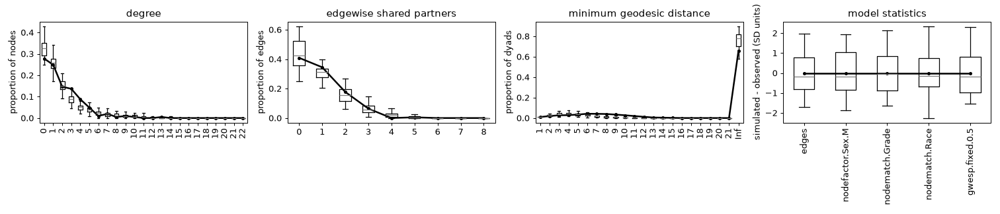

# ergmx

**Exponential-family random graph models (ERGMs) in Python, with a Rust core.**

`ergmx` fits, simulates, summarizes and checks ERGMs with a high-level API in
the spirit of R's [ergm](https://github.com/statnet/ergm) and statnet: R-style
formulas, the same term names and statistics, and `summary()` and `gof()`
that read like R's.

> **Status: proof of concept.** 58 terms and the `offset()` and `F()`
> operators for directed, undirected and bipartite networks; curved ERGMs;
> sample space constraints;
> missing ties; MPLE, contrastive divergence and Monte Carlo MLE; MCMC
> diagnostics, log-likelihoods, model comparison and goodness of fit, all
> validated against R's ergm. See [what's missing](#not-yet).

```python
import ergmx
from ergmx import datasets

g = datasets.load("faux.mesa.high")   # an igraph.Graph; ergm's networks are bundled
fit = ergmx.ergm(
    g, "edges + nodefactor('Sex') + nodematch('Grade') + nodematch('Race') + gwesp(0.5, fixed=TRUE)",
    seed=1,
)
fit.summary()
```

```
Monte Carlo Maximum Likelihood Results:

                   Estimate  Std. Error  MCMC %  z value  Pr(>|z|)
edges               -6.1846      0.1734       0  -35.669    <1e-04 ***
nodefactor.Sex.M    -0.1256      0.0747       0   -1.681   0.09274 .
nodematch.Grade      1.9710      0.1758       0   11.210    <1e-04 ***
nodematch.Race       0.2657      0.1188       0    2.235   0.02539 *
gwesp.fixed.0.5      1.2166      0.0853       0   14.271    <1e-04 ***
---
Signif. codes:  0 '***' 0.001 '**' 0.01 '*' 0.05 '.' 0.1 ' ' 1

Log-likelihood: -867.1531 (MC SE 0.194)   AIC: 1744.3062   BIC: 1784.0461
Converged after 6 iterations (4 chains, 1024 samples).
```

R's ergm gives `-6.1884, -0.1293, 1.9761, 0.2699, 1.2178` and a log-likelihood
of -867.56 on the same model, in 16.8 s; `ergmx` took 2.5 s. (A high-precision
estimate of the log-likelihood is -867.09: R's is off by 0.47, see
[validation](#validation-against-r).)

Then check the fit, as with R's `gof()`:

```python
result = fit.gof()   # degree, edgewise shared partners, geodesic distances, model statistics
print(result["degree"])
result.plot()
```



Check the MCMC and compare models, as with R's `mcmc.diagnostics()` and
`anova()`:

```python
fit.mcmc_diagnostics()        # effective sizes, R-hat across chains, Geweke; .plot() for traces
simpler = ergmx.ergm(g, "edges + nodefactor('Sex') + nodematch('Grade') + nodematch('Race')")
ergmx.compare(simpler, fit)   # log-likelihoods, AIC, BIC, likelihood-ratio test
```

## Features

- **Networks**: `igraph.Graph` or `networkx.Graph`/`DiGraph`, directed or
  undirected. Vertex attributes are available to the terms; edges with
  `na=True` mark missing dyads.
- **Formulas** in R syntax (`"edges + gwesp(0.5, fixed=TRUE)"`, even with
  `net ~` in front), or terms combined with `+`: `edges() + gwesp(0.5, fixed=True)`.
  Nothing is evaluated: arguments must be literals.
- **Terms**, with ergm's definitions and names:

  | | Undirected | Directed |
  |---|---|---|
  | Dyadic | `edges`, `edgecov`, `sociality` | `edges`, `edgecov`, `mutual`, `asymmetric`, `sender`, `receiver` |
  | Degree | `kstar(k)`, `degree(d)`, `isolates`, `concurrent`, `twopath`, `gwdegree` | `istar(k)`, `ostar(k)`, `idegree(d)`, `odegree(d)`, `isolates`, `twopath`, `gwidegree`, `gwodegree` |
  | Triads and cycles | `triangle`, `cycle(k)`, `gwesp`, `gwdsp`, `gwnsp`, `esp(d)`, `dsp(d)`, `nsp(d)` | `triangle`, `ttriple`, `ctriple`, `transitive`, `cycle(k)`, and the shared partner terms with any `type` (OTP, ITP, RTP, OSP, ISP) |
  | Attributes | `nodematch` (`diff=TRUE` too), `nodemix`, `nodefactor`, `nodecov`, `absdiff`, `absdiffcat` | the same, plus `nodeifactor`, `nodeofactor`, `nodeicov`, `nodeocov` |
  | Operators | `offset(term)` (with `-inf` to forbid ties), `F(~terms, ~filter)` | the same |

  Bipartite networks have `b1star`, `b1degree`, `gwb1degree`,
  `b1concurrent`, `b1factor`, `b1cov`, `b1nodematch`, `b1dsp`, `gwb1dsp` and
  their `b2` twins. The geometrically weighted terms take a fixed decay
  (`fixed=TRUE`) or, as in ergm by default, estimate it: curved ERGMs.
  `edgecov('name')` reads an n x n matrix from a graph attribute.
- **Constraints**, as in ergm: `bd` (bounded degrees, for fixed-choice
  designs), `blocks` (fix the dyads of some mixing types), `degrees`,
  `odegrees` and `idegrees`, with degree-preserving MCMC moves.
- **Missing ties**: likelihood inference conditional on the observed dyads
  (Handcock and Gile 2010), assuming they are missing at random, for the
  estimates, standard errors, log-likelihood and goodness of fit.
- **Bipartite networks** (`bipartite=True`): only the ties between modes are
  modeled, with their own terms and ergm's goodness of fit statistics.
- **Curved ERGMs**: the decays of gwesp, gwdegree and the other
  geometrically weighted terms estimated in the MPLE, contrastive divergence,
  the Monte Carlo MLE and the log-likelihood, with an overflow statistic
  where ergm's cutoff stops with an error.
- **Multilevel networks** as one network with a level attribute: `nodemix`
  for densities by kind of tie, `F()` for terms within levels, and `blocks` to
  model some kinds of ties given others.
- **Estimation**:
  - dyad-independent models: the exact MLE (logistic regression), with
    log-likelihood, AIC and BIC;
  - other models: Monte Carlo MLE starting from the MPLE (or from the
    contrastive divergence estimate, `init="CD"`), with Hummel et al. (2012)
    step lengths, the log-normal approximation, an adaptive MCMC interval that
    targets an effective sample size, and standard errors that include the
    MCMC error;
  - `estimate="MPLE"` or `estimate="CD"` for those estimates only;
  - degenerate models stop with a `DegeneracyError` that says why: a density
    guard (as in ergm) and a check that the estimate is still moving, with the
    simulated and observed statistics side by side.
- **Log-likelihood** of dyad-dependent models, with its Monte Carlo standard
  error, by path sampling from the dyad-independent submodel as ergm does,
  but integrated with the Euler-Maclaurin corrected trapezoidal rule: its
  error falls as 1/bridges^4 instead of 1/bridges^2 for ergm's midpoint rule.
  `ergmx.compare(fit1, fit2, ...)` tabulates log-likelihoods, AIC, BIC and
  likelihood-ratio tests of nested models.
- **MCMC diagnostics**: `fit.mcmc_diagnostics()` reports mean deviations from
  the observed statistics, naive and time-series standard errors, effective
  sizes, split R-hat across the parallel chains and Geweke z-scores, with
  trace and density plots.
- **MCMC** in Rust: tie/no-tie (TNT) proposals mixed with triadic proposals,
  which close or open triangles, for models with triangle or shared partner
  terms, directed or not (like ergm's `MH_SPDyad` default). Chains run in
  parallel threads.
- **Goodness of fit**: `fit.gof()` or `ergmx.gof(network, formula, coef)`
  compares the degree (in- and out-degree if directed), edgewise shared
  partner and geodesic distance distributions, and the model statistics,
  with simulated networks: tables with Monte Carlo p-values like R's, and
  `plot()`.
- `ergmx.simulate(network, formula, coef, nsim)` returns graphs of the same
  kind as the input, or their statistics; `fit.simulate()` uses the estimates.
- `ergmx.summary_stats(network, formula)`: R's `summary(net ~ formula)`.
- `ergmx.datasets`: the networks of R's ergm documentation (flomarriage,
  flobusiness, samplk1-3, faux.mesa.high, faux.dixon.high,
  faux.magnolia.high) and multinets' multilevel `linked_sim`.

## Documentation

A user guide, a term reference, the API reference and a guide for R users,
built with Sphinx in `docs/`; every example runs when it is built:

```bash
uv sync --group docs
uv run sphinx-build -W --keep-going -d docs/_build/doctrees docs docs/_build/html
```

`.github/workflows/docs.yml` publishes it to GitHub Pages.

## Validation against R

`scripts/r_reference.R` fits the models below with ergm 4.12 and stores the
results in `tests/data/r_reference.json`; the test suite compares.

| Check | Result |
|---|---|
| Statistics of all 58 terms and both operators, 56 models | identical to R's `summary()` (1e-12), names included, except ergm's order-dependent edgewise RTP statistics, which match their definition computed in R |
| MPLE, 38 models | identical to R (1e-6; curved models 1e-3, with a pseudo-likelihood at least R's) |
| Dyad-independent MLE, standard errors, log-likelihood and BIC (10 models, with offsets, `blocks`, missing dyads and bipartite networks) | identical to R (1e-6; SEs 1e-3, R's `glm` tolerance) |
| Monte Carlo MLE, 7 models (4 undirected, 3 directed) x 3–10 seeds | within 0.12 standard errors of R; SEs within 0.89–1.12 of R's |
| Monte Carlo MLE with constraints, missing dyads, offsets, `F()` and multilevel models, 12 models x 5 seeds | within 0.17 standard errors of R; SEs within 0.91–1.09 of R's |
| Monte Carlo MLE of the new terms, bipartite and curved models (directed and undirected), 10 models x 3–5 seeds | within 0.2 standard errors of R; SEs within 0.90–1.12 of R's, except one curved model with a nearly flat decay |
| Goodness of fit, directed and undirected | observed distributions and p-values identical to R's; simulated distributions agree within Monte Carlo error |
| MCMC stationary distribution, unconstrained and under every constraint | matches exact enumeration of every network each constraint allows on 3 to 6 vertices, directed and undirected |
| Log-likelihood, directed and undirected | unbiased against exact enumeration (6 and 4 vertices), with calibrated standard errors |
| Log-likelihood, 5 dyad-dependent models | within one standard error of high-precision estimates (128 bridges); R's 16-point midpoint rule is off by 0.1 to 2.1 |
| Contrastive divergence | a fixed point of its defining equation; the MLE from a CD start matches R's |

The networks are ergm's flomarriage, samplk3, faux.mesa.high and
faux.dixon.high (248 students, directed friendship nominations), the second
and third also with missing dyads, and multinets' linked_sim. R's own
standard errors vary by about 15% between seeds on the small networks, so the
SE comparison is only as tight as R allows. Full details:
[docs/validation.md](docs/validation.md).

## Performance

`benchmarks/benchmark.R` and `benchmarks/benchmark.py`: median of 3 seeds on an
Apple M4 Pro, both with their defaults, which include the log-likelihood. R's
ergm runs on one thread; the single-threaded ergmx run is limited to one thread
too.

| Model | Vertices | R ergm 4.12 | ergmx, 1 thread | ergmx, all threads | Max \|difference\| |
|---|---|---|---|---|---|
| faux.mesa.high, gwesp(0.5) | 205 | 16.8 s | 10.6 s (1.6x) | 2.5 s (6.6x) | 0.04 SE |
| faux.magnolia.high, gwesp(0.25) | 1,461 | 17.3 s | 15.3 s (1.1x) | 5.5 s (3.1x) | 0.07 SE |
| faux.dixon.high (directed), gwesp(0.1) | 248 | 142 s | 83 s (1.7x) | 17 s (8.1x) | 0.07 SE |

ergmx's log-likelihood samples about 17 times more than ergm's, which is what
makes it accurate. Without the log-likelihood on either side (`eval_loglik=False`
and `eval.loglik = FALSE`), a single thread was 1.9 to 3.6 times faster than R
on these models.

The proposal matters as much as the language: with plain TNT proposals, R
takes 128 s on faux.magnolia.high.

## Architecture

```
python/ergmx/         Python API
  formula.py            R-style formula parsing (Python's ast, no eval)
  terms.py              term definitions: names, parameters, directedness
  _estimation.py        MPLE, contrastive divergence, Monte Carlo MLE, degeneracy checks
  _loglik.py            log-likelihood by path sampling
  _diagnostics.py       MCMC diagnostics
  _gof.py               goodness of fit
  _compare.py           model comparison
  constraints.py        sample space constraints
  datasets.py           ergm's and multinets' networks, bundled in data/
  _fit.py               ErgmFit and its summary table
  _simulate.py          ergm(), simulate(), summary_stats()
src/                  Rust core (PyO3), exposed as ergmx._core.Model
  network.rs            sorted neighbour lists + edge list for O(1) random ties
  terms.rs              the Term trait and the change statistics
  sampler.rs            Metropolis-Hastings: TNT, triadic and degree-preserving moves
  space.rs              the sample space: free dyads, degree bounds
  lib.rs                bindings; chains run in parallel with rayon
```

Adding a term means implementing its change statistic in `src/terms.rs` and
describing it in `python/ergmx/terms.py`.

## Not yet

- Curved ERGMs (the geometrically weighted terms with an estimated decay).
- More terms: `degree(k)`, `isolates`, `nodemix`, `concurrent`, `gwnsp`,
  bipartite terms, `edgecov` of a network attribute given as a network, and
  directed shared partner types other than OTP.
- `bd()` bounds by attribute, and more of ergm's constraints and terms.
- Valued and temporal networks.
- Wheels built for every platform in CI.

## Installation

ergmx needs Python 3.11 or newer. With [uv](https://docs.astral.sh/uv/):

```bash
uv add "ergmx[igraph,plot]"        # in a uv project; or: uv pip install / pip install
```

Releases come as wheels with the Rust core already compiled, for Linux,
macOS and Windows, so no Rust compiler is needed. ergmx is not on PyPI yet:
until then, install it from GitHub, which builds it from source:

```bash
uv add "ergmx[igraph,plot] @ git+https://github.com/neylsoncrepalde/ergmx"
```

Building from source needs a C linker (Xcode Command Line Tools,
`build-essential` or the Visual Studio C++ Build Tools) and Rust 1.88 or
newer. If Rust isn't installed, maturin downloads a private copy (about 500
MB, cached). The [installation guide](docs/user-guide/installation.md) has
the details.

## Development

With [uv](https://docs.astral.sh/uv/) and [rustup](https://rustup.rs):

```bash
git clone https://github.com/neylsoncrepalde/ergmx.git && cd ergmx
rustup toolchain install    # the Rust pinned in rust-toolchain.toml
uv sync                     # Python 3.14, locked dependencies, ergmx built in release mode
uv run pytest               # Python tests
cargo clippy --release --all-targets -- -D warnings && cargo test --release
```

`uv run` rebuilds the Rust core after changes to it. `uv build` makes a wheel
and a source distribution in `dist/`; `.github/workflows/release.yml` builds
the wheels of every platform and publishes them to PyPI when a GitHub release
is published.

To regenerate the R reference results or rerun the benchmark (needs R with
ergm, igraph and jsonlite):

```bash
Rscript scripts/r_reference.R && Rscript scripts/r_gof_reference.R
Rscript benchmarks/benchmark.R && uv run python benchmarks/benchmark.py
```

## License

GPL-3.0, like R's ergm.
